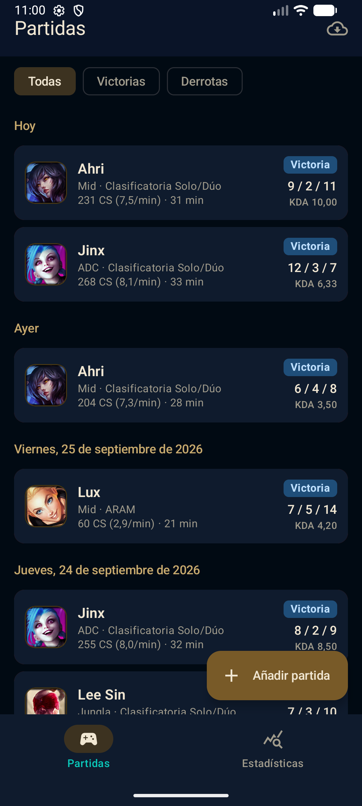
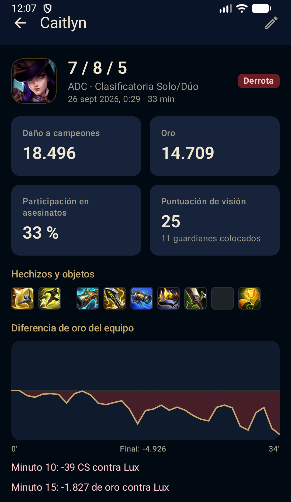
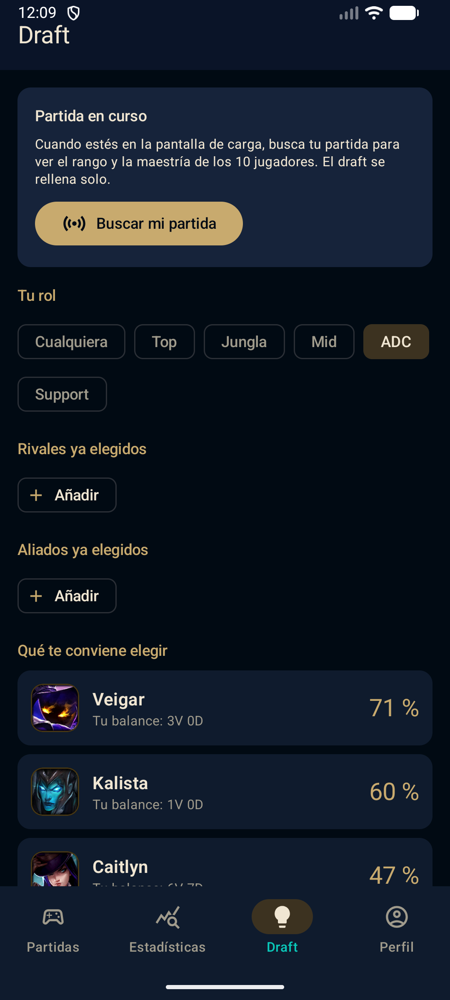
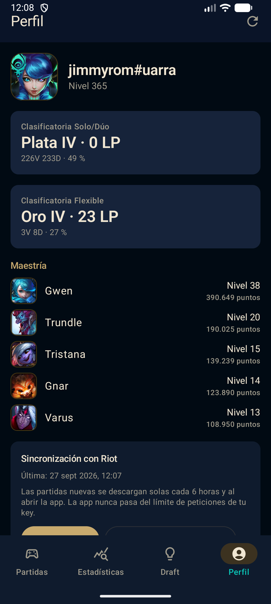
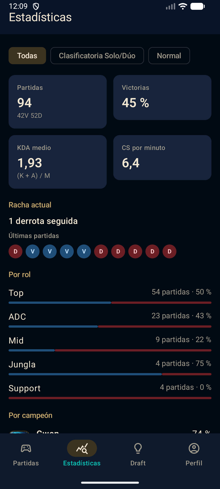
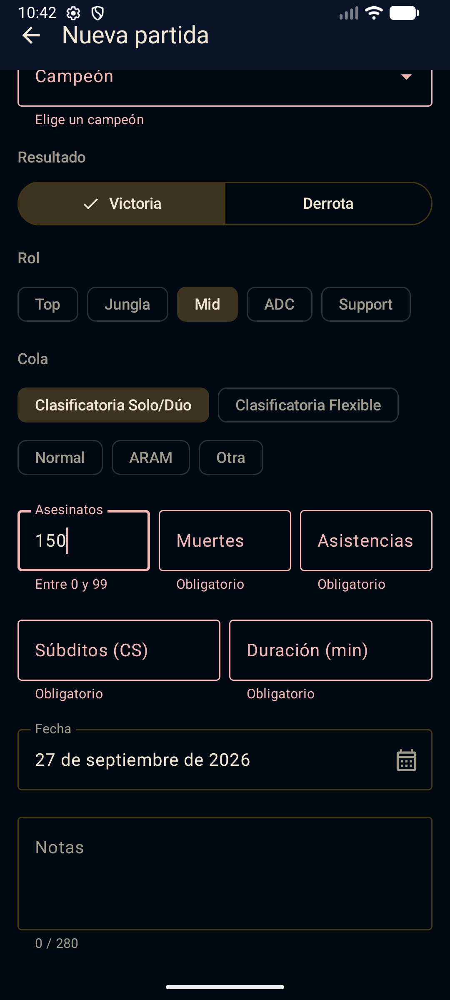
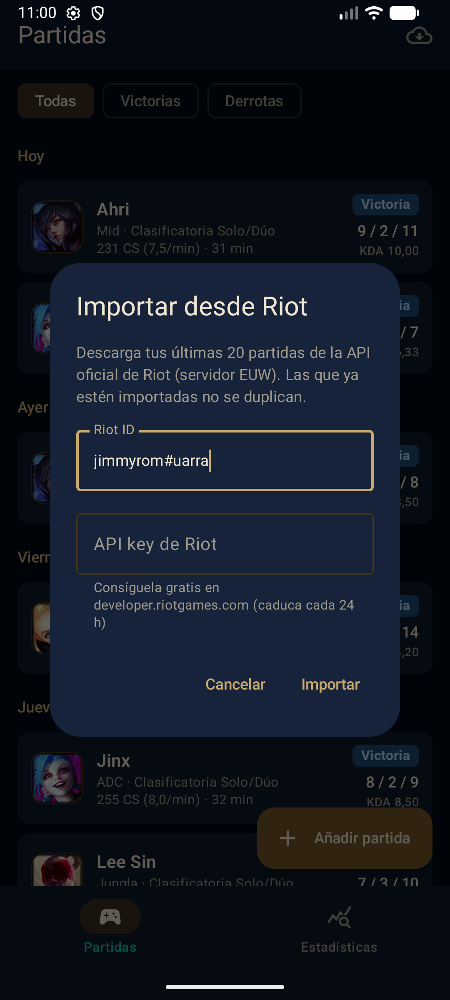
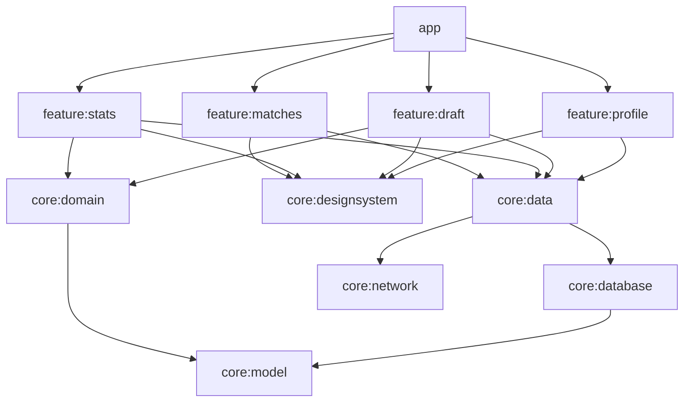

# LoL Tracker · Android (Kotlin + Jetpack Compose)

[](https://github.com/jimmyrom1/lol-tracker/actions/workflows/ci.yml)

App Android para llevar el registro de tus partidas de League of Legends y ver cómo evoluciona tu
juego: porcentaje de victorias, KDA, farmeo por minuto, racha actual y rendimiento por rol y por
campeón. Las partidas se pueden apuntar a mano o **importar directamente desde la API oficial de
Riot** con tu Riot ID, que además da:

- **Detalle de cada partida**: daño, oro, participación en asesinatos, visión, objetos y hechizos,
  los 10 jugadores y la **diferencia de oro minuto a minuto**, con tu ventaja o desventaja de CS y
  oro frente a tu rival de línea.
- **Asistente de draft** basado en tu propio historial: qué campeón te conviene según tu rol, los
  rivales y los aliados ya elegidos.
- **Partida en curso**: en la pantalla de carga, rango y maestría de los 10 jugadores y tu balance
  contra cada campeón rival.
- **Perfil**: rango en Solo/Dúo y Flexible y campeones con más maestría.
- **Sincronización automática** cada 6 horas, sin pasar nunca del límite de peticiones de la key.

Funciona sin conexión: todo se guarda en local y el catálogo de campeones se cachea.

| Partidas | Detalle de partida | Draft | Perfil |
| --- | --- | --- | --- |
|  |  |  |  |

| Estadísticas | Nueva partida | Importar desde Riot |
| --- | --- | --- |
|  |  |  |

## Stack

| Capa | Tecnología |
| --- | --- |
| UI | Jetpack Compose, Material 3, Navigation Compose con rutas *type-safe*, Coil 3 |
| Arquitectura | MVVM + UDF (`StateFlow` inmutable por pantalla), multimódulo por capas y features |
| Datos | Room (esquemas versionados y migraciones automáticas), Retrofit + kotlinx.serialization, OkHttp, WorkManager |
| APIs | Data Dragon (catálogo e iconos), Riot API: account-v1, match-v5 (+ timeline), league-v4, champion-mastery-v4, summoner-v4, spectator-v5 |
| DI | Hilt, con *convention plugins* de Gradle en `build-logic` |
| Calidad | 91 tests en la JVM (JUnit, Turbine, Robolectric, Compose UI Test, MockWebServer), Android Lint |
| CI | GitHub Actions: tests, lint y APK de debug como artefacto |

## Arrancar

Necesitas Android Studio (o el SDK con la plataforma 37) y JDK 21.

```bash
./gradlew installDebug          # instala en el emulador o móvil conectado
./gradlew testDebugUnitTest :core:domain:test   # todos los tests, sin emulador
```

Para tener datos con los que jugar sin apuntar nada, la build de debug incluye un cargador de
partidas de ejemplo (no existe en la release):

```bash
adb shell am start -n dev.jose.loltracker/.DemoDataActivity
```

### Importar tus partidas de Riot

1. Entra en <https://developer.riotgames.com> con tu cuenta de Riot y copia la
   *Development API Key* (es gratuita y caduca cada 24 horas), o registra el proyecto como
   *Personal Product* para tener una *Personal API Key* que no caduca.
2. En la app, pulsa el icono de la nube en **Partidas**, escribe tu Riot ID (`nombre#etiqueta`) y
   pega la key. Se descargan las 20 últimas partidas del servidor EUW. Desde **Perfil** puedes
   traer las últimas 100.

También puedes dejar la key fuera de la app, en `local.properties` (que no se sube a git) o en la
variable de entorno `RIOT_API_KEY`:

```properties
riot.apiKey=RGAPI-xxxxxxxx-xxxx-xxxx-xxxx-xxxxxxxxxxxx
```

### Con servidor propio (sin key en el móvil)

Para una app pública, la key de Riot no puede ir dentro del APK. Con
[lol-tracker-api](https://github.com/jimmyrom1/lol-tracker-api) la key se queda en el servidor, y
la caché es compartida: una partida se descarga una vez aunque la abran los 10 jugadores.

```properties
# local.properties (10.0.2.2 es el PC visto desde el emulador)
lolApi.url=http://10.0.2.2:3000
lolApi.token=
```

Con `lolApi.url` definida, las peticiones van a `<servidor>/riot/europe/...` y
`<servidor>/riot/euw1/...` con las mismas rutas de Riot, y la app manda `X-App-Token` en lugar de
la key. **El build deja de incluir `riot.apiKey`** aunque siga en `local.properties`; se comprobó
buscando la key dentro del APK. El HTTP sin cifrar hacia `10.0.2.2` solo se permite en el build
de debug (`network_security_config`).

Probado de punta a punta en el emulador: con la app recién instalada y sin key, la primera
importación pasa por el servidor, que pide a Riot. Una segunda instalación importa las mismas 16
partidas en 2,5 s **sin ninguna petición a Riot**.

## Módulos



- `core:model` y `core:domain` son **Kotlin puro** (sin Android): las reglas de validación y el
  cálculo de estadísticas se testean en milisegundos.
- Las features no se conocen entre sí; solo `app` las une en el grafo de navegación.
- Las features solo ven interfaces de repositorio: ni Room ni Retrofit llegan a la UI.
- `build-logic` tiene los *convention plugins* (`lol.android.feature`, `lol.hilt`...), así que
  cada `build.gradle.kts` de módulo ocupa unas pocas líneas.

## Decisiones técnicas

### No pasar nunca del límite de la key

Riot limita cada key a 20 peticiones por segundo y 100 cada 2 minutos, por región de enrutado.
Recibir `429` a menudo puede acabar con la key suspendida, así que la app no espera a que Riot
se queje:

- [`RiotRateLimiter`](core/network/src/main/kotlin/dev/jose/loltracker/core/network/RiotRateLimiter.kt)
  es un interceptor de OkHttp con ventanas deslizantes por host (`europe` y `euw1` cuentan por
  separado, como en Riot). Bloquea cada petición hasta que cabe, con margen: **15/s y 90/2 min**. Hay
  una sola instancia para toda la app, así que la sincronización en segundo plano y las pantallas
  comparten el mismo presupuesto.
- Un test lanza 200 peticiones con un reloj falso y comprueba que ninguna ventana de 1 s o de
  2 min se pasa. En el emulador, importar 100 partidas (≈85 peticiones) tardó 36 s sin un solo
  `429`.
- Si aun así llega un `429` (la misma key usada desde otro sitio), se respeta `Retry-After` y se
  reintenta una vez.

**Cada dato se pide lo menos posible:**

| Dato | Cuándo se pide | Coste |
| --- | --- | --- |
| Partida jugada | Una vez: no cambia, se guarda en Room | 1 petición |
| Remake | Una vez: se recuerda que se descartó | 1 petición |
| Línea temporal | Solo al abrir el detalle, y una vez | 1 petición |
| PUUID de la cuenta | Una vez: se guarda | 1 petición |
| Perfil (rango y maestría) | Caché de 10 minutos | 3 peticiones |
| Rango y maestría de otros jugadores | Caché de 30 min / 12 h | 2 por jugador |
| Partida en curso | Solo al pulsar el botón, nunca en bucle | 1 + hasta 20 |
| Sincronización | Cada 6 h con red, y al abrir la app si han pasado 15 min | 1 + 1 por partida nueva |

Si Riot rechaza la key, la tarea de fondo **no reintenta** (`Result.failure()`), porque insistir
con una key inválida es justo lo que Riot vigila. Solo reintenta con backoff los fallos de red.

### El asistente de draft usa tu historial, no estadísticas globales

La API gratuita no da para descargar millones de partidas, y además lo que funciona para ti es más
útil que la media de todo el mundo.
[`DraftAdvisor`](core/domain/src/main/kotlin/dev/jose/loltracker/core/domain/DraftAdvisor.kt) es
una función pura:

- La puntuación es un porcentaje de victorias **bayesiano**: se suman 4 partidas imaginarias al
  50 %. Así un 1-0 (60 %) no gana a un 8-4 (62,5 %).
- Las partidas contra los rivales o junto a los aliados de este draft cuentan el doble, porque se
  parecen más a la que vas a jugar.
- No sugiere campeones que ya están cogidos, y respeta el rol.
- En la partida en curso, la API de espectador da los ids numéricos de los campeones. Se traducen
  con el `key` de Data Dragon, que hubo que añadir al catálogo (migración v3). Así el draft se
  rellena solo.

### Detalle de partida sin tablas de más

Los 10 jugadores, los objetivos y el resumen de la línea temporal se guardan como JSON en una fila
por partida (`match_details`). Nunca se consultan por columnas, y así el esquema no depende de
los ~150 campos que devuelve Riot. La línea temporal completa (~1 MB) no se guarda: se resume al
llegar en la diferencia de oro por minuto y las diferencias en línea a los 10 y 15 minutos. Las
partidas importadas antes de que existiera el detalle se completan solas, 20 por sincronización.

### Importación desde Riot sin duplicados

- La cuenta se busca por Riot ID (account-v1) para obtener el `puuid`, y con él se piden los ids de
  las últimas partidas (match-v5).
- Antes de descargar ninguna partida se consulta qué ids ya están en Room. Así, una segunda
  importación solo gasta peticiones en las partidas nuevas, lo que importa porque la key de
  desarrollo admite 100 peticiones cada 2 minutos.
- Aun así, la garantía la da la base de datos: `riot_match_id` tiene un **índice único** y la
  inserción usa `OnConflictStrategy.IGNORE`. Si dos importaciones se solapan, no se duplica nada.
- Si Riot responde `429`, un interceptor de OkHttp espera lo que indica `Retry-After` y reintenta
  una vez.
- Se ignoran los *remakes* (menos de 5 minutos o `gameEndedInEarlySurrender`), porque no son
  partidas jugadas.
- match-v5 no siempre escribe el campeón igual que Data Dragon (`FiddleSticks` frente a
  `Fiddlesticks`), así que se cruza sin distinguir mayúsculas y se muestra el nombre traducido
  (`MonkeyKing` → Wukong).
- Una partida importada se puede editar (por ejemplo, para añadirle notas) sin perder su id de Riot
  ni la duración exacta en segundos. Si los perdiera, la siguiente importación la duplicaría. Lo
  cubre un test.

### La API key nunca está en el repositorio

La key se lee en cada petición a través de `RiotApiKeyProvider`: primero la que escribe el usuario
en la app y, si no hay, la de `local.properties` o `RIOT_API_KEY`, que se compila en `BuildConfig`.
Sin key, la petición no sale: el interceptor la corta y la app muestra un aviso. Esta solución vale
para uso personal. Una app publicada necesitaría un backend propio que guarde la key y haga de
intermediario, porque cualquier cosa incluida en un APK se puede extraer.

### Offline first

- Las pantallas observan `Flow`s de Room. La red solo sirve para rellenar la caché.
- El catálogo de campeones (unos 170, con iconos) solo se descarga cuando sale un parche nuevo, y
  se sustituye en una transacción para que nunca se vea una lista a medias.
- Sin conexión, la app avisa una vez y sigue funcionando con lo guardado. Si falta un icono, se
  muestran las iniciales del campeón.

### Estadísticas correctas

- El KDA medio se calcula **agregado**, `(ΣK + ΣA) / ΣM`, y no como la media de los KDA de cada
  partida. Si no, una sola partida 10/0/10 pesaría tanto como diez partidas normales. Es como lo
  calculan op.gg y similares.
- Sin muertes se divide entre 1 (*perfect KDA*).
- Las partidas de ARAM cuentan para los totales pero no para la tabla por rol, porque en ARAM no
  hay calles.
- Los días se agrupan según la zona horaria del dispositivo. El reloj se inyecta (`Clock`), así que
  los tests fijan fecha y zona: una partida a las 23:30 UTC cae "mañana" en Madrid.

### Room con migraciones testeadas

Los esquemas se exportan a `core/database/schemas/` y se versionan en git. La v2 (columna
`riot_match_id`) usa `AutoMigration`, y `MigrationTest` crea una base v1 con datos reales, la migra
y comprueba que no se pierde nada. También se ha probado en el emulador actualizando la app encima
de una instalación con partidas.

### Dos bugs que salieron probando en el emulador

- **Deshacer un borrado volvía a borrar la partida.** `rememberSwipeToDismissBoxState()` es
  *saveable*. Al deshacer, la partida vuelve con el mismo `key` y la `LazyColumn` restauraba el
  estado "descartado", así que el borrado se ejecutaba otra vez. Se detectó en el log de
  analítica (`match_delete_undone` seguido de `match_deleted` 80 ms después) y se corrigió con un
  estado no persistente.
- **El botón "Deshacer" quedaba tapado por el FAB.** El snackbar vivía en el `Scaffold` externo. Se
  movió al `Scaffold` de la pantalla, que es el que sabe colocar el FAB por encima del snackbar.

### Analítica desacoplada

Las pantallas registran eventos (`screen_view`, `match_created`, `riot_import`...) a través de la
interfaz `AnalyticsTracker`. Ahora mismo se escriben en Logcat, pero cambiar a Firebase o a otro
proveedor sería una implementación nueva, sin tocar las features. En los tests se usa un
*tracker* en memoria para comprobar qué eventos se envían.

## Tests

| Módulo | Qué cubren |
| --- | --- |
| `core:domain` | Validación del formulario, KDA agregado, rachas, forma reciente, agrupación por rol y campeón |
| `core:database` | DAOs sobre Room en memoria (Robolectric), índice único de Riot, migraciones v1 → v2 → v3 |
| `core:network` | Parseo de Data Dragon y Riot con MockWebServer, cabecera de la key, reintento tras `429`, limitador de peticiones con reloj falso |
| `core:data` | Contra Room real y un servidor de Riot simulado: importación sin duplicados, peticiones exactas por sincronización, relleno de detalles antiguos, caché de perfil y partida en curso, resumen de la línea temporal |
| `core:domain` (draft) | Suavizado bayesiano, peso de los enfrentamientos, filtro de rol y campeones ya cogidos |
| `feature:*` | ViewModels con repositorios falsos y Turbine; formulario en Compose con Robolectric |

## Otros proyectos

Forma parte de una serie de proyectos con el mismo enfoque: reglas de negocio garantizadas
por la base de datos o por funciones puras, tests que prueban los casos difíciles y CI en cada push.

| Proyecto | Qué es |
| --- | --- |
| [LoL Tracker API](https://github.com/jimmyrom1/lol-tracker-api) | Backend en Node.js 24 + TypeScript + Fastify: proxy de la API de Riot con caché compartida en PostgreSQL, límite de peticiones y la key solo en el servidor. |
| [Subscriptions API](https://github.com/jimmyrom1/subscriptions-api) | API REST con Java 21 y Spring Boot 4: prorrateo, facturación idempotente, ShedLock, Flyway y Testcontainers. |
| [Reserva de salas](https://github.com/jimmyrom1/room-booking) | Flask + PostgreSQL + React: reservas sin solapes garantizadas por un `EXCLUDE` de PostgreSQL, JWT y exportación a calendario. |
| [Mini Facturas](https://github.com/jimmyrom1/mini-invoice-generator) | Flask + PostgreSQL + React: facturas con IVA por línea, IRPF, numeración correlativa atómica y PDF. |
| [Double-Entry Ledger](https://github.com/jimmyrom1/double-entry-ledger) | FastAPI + Asyncpg + PostgreSQL + React: motor contable con invariante de suma cero diferido, inmutabilidad y bloqueos pesimistas ordenados. |
| [Rate Limiter & Circuit Breaker gRPC](https://github.com/jimmyrom1/rate-limiter-grpc) | Go + gRPC + Protocol Buffers: control de tráfico (~90 ns/op) con Token Bucket, Sliding Window, Leaky Bucket y Circuit Breaker. |
| [Live Auction Engine](https://github.com/jimmyrom1/live-auction-engine) | Node.js 24 + WebSockets + SQLite WAL + React 19: subastas en tiempo real con resolución atómica de carreras concurrentes y anti-sniping. |


## Licencia

MIT. League of Legends es una marca de Riot Games. Este proyecto no está respaldado por Riot y solo
usa sus APIs públicas.
