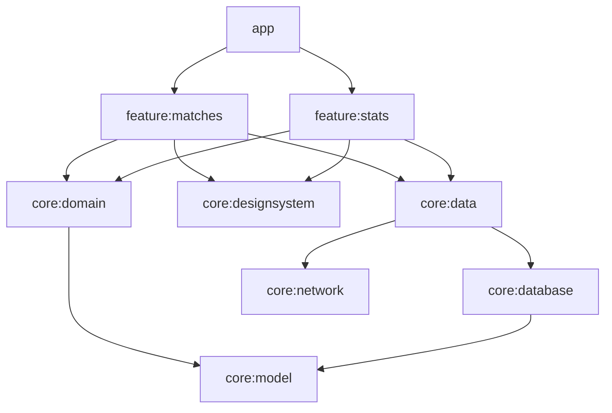

# LoL Tracker · Android (Kotlin + Jetpack Compose)

[](https://github.com/jimmyrom1/lol-tracker/actions/workflows/ci.yml)

App Android para llevar el registro de tus partidas de League of Legends y ver cómo evoluciona tu
juego: porcentaje de victorias, KDA, farmeo por minuto, racha actual y rendimiento por rol y por
campeón. Las partidas se pueden apuntar a mano o **importar directamente desde la API oficial de
Riot** con tu Riot ID. Funciona sin conexión: todo se guarda en local y el catálogo de campeones
se cachea.

| Partidas | Estadísticas | Nueva partida | Importar desde Riot |
| --- | --- | --- | --- |
|  |  |  |  |

## Stack

| Capa | Tecnología |
| --- | --- |
| UI | Jetpack Compose, Material 3, Navigation Compose con rutas *type-safe*, Coil 3 |
| Arquitectura | MVVM + UDF (`StateFlow` inmutable por pantalla), multimódulo por capas y features |
| Datos | Room (esquemas versionados y migración automática), Retrofit + kotlinx.serialization, OkHttp |
| APIs | Data Dragon (catálogo e iconos de campeones), Riot API account-v1 y match-v5 |
| DI | Hilt, con *convention plugins* de Gradle en `build-logic` |
| Calidad | 58 tests en la JVM (JUnit, Turbine, Robolectric, Compose UI Test, MockWebServer), Android Lint |
| CI | GitHub Actions: tests, lint y APK de debug como artefacto |

## Arrancar

Necesitas Android Studio (o el SDK con la plataforma 37) y JDK 21.

```bash
./gradlew installDebug          # instala en el emulador o móvil conectado
./gradlew testDebugUnitTest :core:domain:test   # todos los tests, sin emulador
```

Para tener datos con los que jugar sin apuntar nada, la build de debug incluye un cargador de
partidas de ejemplo (no existe en la release):

```bash
adb shell am start -n dev.jose.loltracker/.DemoDataActivity
```

### Importar tus partidas de Riot

1. Entra en <https://developer.riotgames.com> con tu cuenta de Riot y copia la
   *Development API Key* (es gratuita y caduca cada 24 horas).
2. En la app, pulsa el icono de la nube en **Partidas**, escribe tu Riot ID (`nombre#etiqueta`) y
   pega la key. Se descargan las 20 últimas partidas del servidor EUW.

También puedes dejar la key fuera de la app, en `local.properties` (que no se sube a git) o en la
variable de entorno `RIOT_API_KEY`:

```properties
riot.apiKey=RGAPI-xxxxxxxx-xxxx-xxxx-xxxx-xxxxxxxxxxxx
```

## Módulos



- `core:model` y `core:domain` son **Kotlin puro** (sin Android): las reglas de validación y el
  cálculo de estadísticas se testean en milisegundos.
- Las features no se conocen entre sí; solo `app` las une en el grafo de navegación.
- Las features solo ven interfaces de repositorio: ni Room ni Retrofit llegan a la UI.
- `build-logic` tiene los *convention plugins* (`lol.android.feature`, `lol.hilt`...), así que
  cada `build.gradle.kts` de módulo ocupa unas pocas líneas.

## Decisiones técnicas

### Importación desde Riot sin duplicados

- La cuenta se busca por Riot ID (account-v1) para obtener el `puuid`, y con él se piden los ids de
  las últimas partidas (match-v5).
- Antes de descargar ninguna partida se consulta qué ids ya están en Room. Así, una segunda
  importación solo gasta peticiones en las partidas nuevas, lo que importa porque la key de
  desarrollo admite 100 peticiones cada 2 minutos.
- Aun así, la garantía la da la base de datos: `riot_match_id` tiene un **índice único** y la
  inserción usa `OnConflictStrategy.IGNORE`. Si dos importaciones se solapan, no se duplica nada.
- Si Riot responde `429`, un interceptor de OkHttp espera lo que indica `Retry-After` y reintenta
  una vez.
- Se ignoran los *remakes* (menos de 5 minutos o `gameEndedInEarlySurrender`), porque no son
  partidas jugadas.
- match-v5 no siempre escribe el campeón igual que Data Dragon (`FiddleSticks` frente a
  `Fiddlesticks`), así que se cruza sin distinguir mayúsculas y se muestra el nombre traducido
  (`MonkeyKing` → Wukong).
- Una partida importada se puede editar (por ejemplo, para añadirle notas) sin perder su id de Riot
  ni la duración exacta en segundos. Si los perdiera, la siguiente importación la duplicaría. Lo
  cubre un test.

### La API key nunca está en el repositorio

La key se lee en cada petición a través de `RiotApiKeyProvider`: primero la que escribe el usuario
en la app y, si no hay, la de `local.properties` o `RIOT_API_KEY`, que se compila en `BuildConfig`.
Sin key, la petición no sale: el interceptor la corta y la app muestra un aviso. Esta solución vale
para uso personal. Una app publicada necesitaría un backend propio que guarde la key y haga de
intermediario, porque cualquier cosa incluida en un APK se puede extraer.

### Offline first

- Las pantallas observan `Flow`s de Room. La red solo sirve para rellenar la caché.
- El catálogo de campeones (unos 170, con iconos) solo se descarga cuando sale un parche nuevo, y
  se sustituye en una transacción para que nunca se vea una lista a medias.
- Sin conexión, la app avisa una vez y sigue funcionando con lo guardado. Si falta un icono, se
  muestran las iniciales del campeón.

### Estadísticas correctas

- El KDA medio se calcula **agregado**, `(ΣK + ΣA) / ΣM`, y no como la media de los KDA de cada
  partida. Si no, una sola partida 10/0/10 pesaría tanto como diez partidas normales. Es como lo
  calculan op.gg y similares.
- Sin muertes se divide entre 1 (*perfect KDA*).
- Las partidas de ARAM cuentan para los totales pero no para la tabla por rol, porque en ARAM no
  hay calles.
- Los días se agrupan según la zona horaria del dispositivo. El reloj se inyecta (`Clock`), así que
  los tests fijan fecha y zona: una partida a las 23:30 UTC cae "mañana" en Madrid.

### Room con migraciones testeadas

Los esquemas se exportan a `core/database/schemas/` y se versionan en git. La v2 (columna
`riot_match_id`) usa `AutoMigration`, y `MigrationTest` crea una base v1 con datos reales, la migra
y comprueba que no se pierde nada. También se ha probado en el emulador actualizando la app encima
de una instalación con partidas.

### Dos bugs que salieron probando en el emulador

- **Deshacer un borrado volvía a borrar la partida.** `rememberSwipeToDismissBoxState()` es
  *saveable*. Al deshacer, la partida vuelve con el mismo `key` y la `LazyColumn` restauraba el
  estado "descartado", así que el borrado se ejecutaba otra vez. Se detectó en el log de
  analítica (`match_delete_undone` seguido de `match_deleted` 80 ms después) y se corrigió con un
  estado no persistente.
- **El botón "Deshacer" quedaba tapado por el FAB.** El snackbar vivía en el `Scaffold` externo. Se
  movió al `Scaffold` de la pantalla, que es el que sabe colocar el FAB por encima del snackbar.

### Analítica desacoplada

Las pantallas registran eventos (`screen_view`, `match_created`, `riot_import`...) a través de la
interfaz `AnalyticsTracker`. Ahora mismo se escriben en Logcat, pero cambiar a Firebase o a otro
proveedor sería una implementación nueva, sin tocar las features. En los tests se usa un
*tracker* en memoria para comprobar qué eventos se envían.

## Tests

| Módulo | Qué cubren |
| --- | --- |
| `core:domain` | Validación del formulario, KDA agregado, rachas, forma reciente, agrupación por rol y campeón |
| `core:database` | DAOs sobre Room en memoria (Robolectric), índice único de Riot, migración v1 → v2 |
| `core:network` | Parseo de Data Dragon y Riot con MockWebServer, cabecera de la key, reintento tras `429` |
| `core:data` | Caché de campeones por parche, importación de Riot de punta a punta (remakes, duplicados, errores) |
| `feature:*` | ViewModels con repositorios falsos y Turbine; formulario en Compose con Robolectric |

## Licencia

MIT. League of Legends es una marca de Riot Games. Este proyecto no está respaldado por Riot y solo
usa sus APIs públicas.
